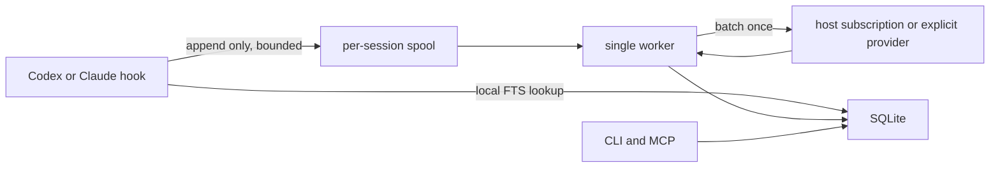

# Memory

Local-first persistent memory for Codex and Claude Code. No additional subscription and no critical-path model calls.

## Product decision

Build a new, small implementation. Do not fork `claude-mem`.

`claude-mem` is Apache-2.0 and useful as a behavioral reference and migration source, but its worker, sidecars, cloud paths, UI, compatibility layers, and provider logic are already the source of the reliability problem. Copying that architecture would copy the failure modes.

V1 targets one developer, one machine, Codex, Claude Code, Windows, macOS, and Linux. Cross-device sync and teams are separate products and stay out until the local system is boring and reliable.

## Hard requirements

- Local-first. SQLite and raw event files are the source of truth.
- Default extraction reuses the logged-in Codex or Claude subscription with an explicit low-cost model.
- Host extraction must disclose that it consumes subscription quota. Local and BYOK providers remain opt-in alternatives.
- Hooks fail open. Memory failure must never block, erase, or delay a prompt or tool call.
- No model or network call from a hook.
- No daemon bootstrap from a hook.
- One binary, one database, no Chroma or other sidecar.
- Native Windows, macOS, and Linux support from the first release.
- No Bash, PowerShell, Node, Bun, Python, or package-manager dependency in the installed hook path.
- Bounded event size, database size, logs, retries, model input, and model spend.
- Every generated memory has provenance and can be corrected, superseded, or deleted.
- No telemetry by default.
- Codex and Claude Code are equal v1 clients.
- Agent-specific behavior lives behind adapters. The core has no Codex-specific or Claude-specific schema.

## User flow

```text
memory init
memory service install
memory provider status
memory doctor

# Codex and Claude sessions now share the same memory automatically.

memory search "why did we reject redis?"
memory remember "Use pnpm in this repository"
memory forget <id>
memory inspect <id>
memory export --format jsonl
```

Installation registers agent hooks and the local MCP server. The Codex integration ships as a plugin containing hooks, MCP configuration, and a small usage skill. It does not edit `AGENTS.md`, `CLAUDE.md`, or project instructions.

## Architecture



### Binary commands

- `memory hook <agent> <event>`: normalize agent input, append an event, optionally return bounded context, and always fail open.
- `memory worker`: consume the durable spool, extract memories in batches, and maintain retention limits.
- `memory mcp`: stdio MCP server for recall and explicit writes.
- `memory init|doctor|status`: initialize storage and inspect the worker.
- `memory service install|uninstall|status`: manage the native per-user worker.
- `memory search|recent|inspect|remember|forget|export|import`: direct user control.

### Stack

- Go
- Official MCP Go SDK
- SQLite with WAL and FTS5
- Atomic JSON event spool partitioned by agent session
- Isolated Codex and Claude CLI subprocesses for host-subscription extraction
- Standard HTTP clients for Ollama and explicit API providers
- Release binaries for macOS, Linux, and Windows

Go gives us fast process startup, a single distributable binary, cheap concurrency, and a supported MCP SDK. Avoid Node and Bun in the hook path.

### Platform support

- Publish native binaries for Windows amd64/arm64, macOS amd64/arm64, and Linux amd64/arm64.
- Generate native Codex and Claude hook commands, including explicit Windows command variants.
- Use OS-native config and data directories. Never construct paths by concatenating home-directory strings.
- Run the worker per user without administrator access: Task Scheduler on Windows, LaunchAgent on macOS, and a systemd user unit on Linux.
- Treat the worker as optional from the agent's perspective. Hooks continue safely when startup integration is unavailable.
- Test spaces, Unicode, long paths, CRLF, locked files, antivirus delays, and concurrent sessions on every OS.
- Cross-compile the Go binary without CGO. The selected SQLite implementation must provide FTS5 consistently on every target.

## Agent adapters

Both adapters produce the same internal events. Adapter code owns input normalization, hook output formatting, capability detection, and installation.

### Codex

- Package as a Codex plugin with `.codex-plugin/plugin.json`, `hooks/hooks.json`, MCP configuration, and a usage skill.
- Use `SessionStart` for briefing on startup, resume, clear, and compact.
- Use `UserPromptSubmit` for prompt capture and bounded local recall.
- Use `PostToolUse` for local shell, `apply_patch`, local function tools, and MCP tools.
- Use `PreCompact`, `Stop`, `Interrupt`, and `SessionEnd` as durable checkpoints.
- Use `SubagentStart` to inject relevant project context and `SubagentStop` to capture the subagent outcome.
- Always return exit code 0. Never return `continue: false`, a blocking decision, or a non-empty warning for internal failures.
- Do not parse Codex transcripts. Their format is not a stable hook interface.
- Codex hosted tools are not visible to tool hooks. Capture their durable outcome from `Stop`, `Interrupt`, and the last assistant message.
- The same plugin and MCP configuration must work in Codex desktop, CLI, and IDE clients on the same host.

### Claude Code

- Package as a Claude Code plugin with native hooks and MCP configuration.
- Use equivalent lifecycle events and map them to the shared event schema.
- Prefer `PostToolBatch` where supported, otherwise use filtered `PostToolUse` events.
- Never rely on active Claude session state. Host extraction invokes an isolated non-interactive Claude CLI process using the logged-in subscription.

## Capture path

### `SessionStart`

- Resolve the project from the Git root and canonical remote when available.
- Return a compact project briefing from existing memories.
- Process no backlog and call no model.
- Hard output budget: 1,500 tokens.

### `UserPromptSubmit`

- Append the user prompt.
- Run bounded FTS retrieval using the prompt.
- Return only high-scoring memories not already injected in the session.
- Hard deadline: 100 ms. On timeout, return no context and exit 0.

### `PostToolUse`, tool failure events, and `PostToolBatch`

- Prefer `PostToolBatch` where the installed agent supports it.
- Capture mutations, commands, failures, paths, exit status, and clipped textual output.
- Drop base64, binary data, screenshots, full file reads, and known secret material.
- Append only. Do not summarize or search.

### `Stop`, `Interrupt`, `SessionEnd`, and `PreCompact`

- Append a checkpoint marker.
- Wake the already-running worker if available.
- Return immediately. Backlog remains durable if the worker is down.

## Data model

### Projects

- Stable ID from canonical Git identity, not directory basename.
- Current roots and remotes are aliases so worktrees share memory.

### Sessions and events

- Adapter, external session ID, project ID, timestamps, sequence, event kind.
- Sanitized payload, content hash, and processing state.
- Unique adapter/session/sequence key makes ingestion idempotent.

### Memories

- Kinds: `decision`, `fact`, `preference`, `procedure`, `failure`, `outcome`, `note`.
- Scope: `project` or `global`.
- State: `active`, `superseded`, `retracted`.
- Content, confidence, provenance, timestamps, tags, and source paths.
- Fingerprint for deduplication.
- Optional `supersedes_id` and `valid_until` for temporal correction.

Do not store an assistant hypothesis as a fact. Prefer user statements, successful tool results, committed changes, and explicit decisions. Contradictory newer evidence supersedes an old memory instead of silently coexisting with it.

## Extraction

- Batch by checkpoint, not by tool call.
- Pre-filter and clip events before sending them to a model.
- Default host provider: logged-in Codex with Luna and logged-in Claude with Haiku.
- Optional local or remote OpenAI-compatible providers require explicit configuration.
- Structured model output validated against a strict schema.
- Compare each checkpoint with bounded active project memory and atomically supersede direct contradictions.
- Failed validation is retried once with a small repair prompt, then parked.
- Content hash makes jobs idempotent.
- Circuit breaker stops provider calls after repeated auth, quota, or rate-limit failures.
- Per-run and monthly token/cost caps are enforced locally.

## Retrieval

V1 uses SQLite FTS5 plus deterministic ranking:

```text
score = lexical relevance + confidence + project match + recency decay + user-pinned boost
```

Return a small diversified set. Avoid injecting five versions of the same fact. Track injected memory IDs per session so context is not repeated.

Embeddings are phase two. Store vectors in SQLite and brute-force the small memory corpus first. Add an SQLite vector extension only after benchmarks justify it. Do not add a vector database service.

## MCP surface

- `memory_search(query, project?, kinds?, limit?)`
- `memory_recent(project?, limit?)`
- `memory_get(id)`
- `memory_remember(content, project?, kind?)`
- `memory_forget(id)`
- `memory_correct(id, replacement)`

Search results include IDs, state, confidence, dates, and provenance. Mutation tools never hide what changed.

## Privacy and resource limits

- `.memoryignore` plus built-in exclusions for `.env`, credentials, keys, caches, dependencies, and files outside the project root.
- Secret-pattern redaction before data reaches the spool.
- Tool output clipped per event and per session.
- Raw events expire after a configurable retention window.
- Default hard caps: 256 MB raw spool, 1 GB database, 32 MB logs.
- Exponential retry backoff with a maximum attempt count.
- `doctor` reports backlog, failed jobs, database integrity, provider state, hook latency, and actual disk use.

## Migration

`memory import claude-mem <db>` opens the source database read-only and imports observations and session summaries.

- Never mutate the source database.
- Preserve original IDs as provenance.
- Make repeat imports idempotent.
- Import textual memory only. Do not import Chroma state.
- Produce a count of imported, skipped, and invalid records.

## Delivery slices

### 1. Capture without AI

- Go module, CLI, config, project identity, SQLite migrations, atomic JSON spool.
- Codex plugin, Claude plugin, and shared installer.
- Recorded Codex and Claude fixtures for session, prompt, tool, subagent, stop, interrupt, and compaction events.
- Native worker startup and hook installation on Windows, macOS, and Linux.
- CI matrix covering all supported operating systems and architectures available to hosted runners.
- FTS search, manual remember/forget, export.

Gate: Codex and Claude behave normally on Windows, macOS, and Linux with the worker killed, database locked, spool full, and malformed hook input.

### 2. Worker and extraction

- Durable job state, local OpenAI-compatible provider, schema validation, provenance, dedupe, corrections, retention.
- Status and doctor commands.

Gate: ten concurrent sessions produce one idempotent summary each with bounded disk and model usage.

### 3. Automatic recall and MCP

- Session briefing, prompt retrieval, and subagent briefing in both agents.
- Stdio MCP server and plugin configuration for Codex and Claude.
- Context budgets and per-session duplicate suppression.

Gate: relevant prior decisions are recalled without measurable agent disruption or irrelevant context flooding.

### 4. Migration and packaging

- Read-only claude-mem importer.
- Signed release artifacts and checksums for every supported platform.
- Cross-platform upgrade, uninstall, backup, and restore tests.

Gate: a clean machine can install into Codex and Claude, import, use, and fully uninstall without orphan processes or data loss.

### Later

- Cursor and other agent adapters.
- Optional embeddings.
- Encrypted user-owned sync target.
- Team scopes and access control.
- Viewer UI.

## Acceptance budgets

- Capture hook p99 under 25 ms.
- Recall hook p99 under 100 ms on 100,000 memories.
- Hook exit code is 0 for every internal failure.
- The same acceptance suite passes on Windows, macOS, and Linux.
- Zero model or network traffic from hooks. The worker uses the configured extraction provider only.
- At most one extraction batch per completed session checkpoint.
- No unbounded retry loop, log, queue, event payload, or database table.
- Full backup and restore is copying the data directory while stopped or using `memory export`.

## First implementation task

Build slice 1 with recorded Codex and Claude hook fixtures and fault-injection tests. Prove both integrations in their real hosts. Do not touch model integration until both hook paths are fail-open and bounded.
